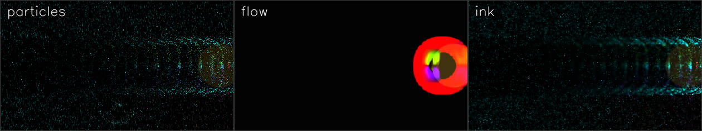

# 🌈 FluxCam — paint with motion

Point your webcam at yourself and **move**. Thousands of glowing particles get swept along by
your movement, leaving neon trails that fade like a long exposure. Nothing is scripted — every
frame the program measures how the picture is *flowing* and pushes the particles with it.

Then **reach in and touch it**: pinch your fingers to *grab and fling* the particles, or hold up
an open palm to *push* them away — live hand tracking, no controller.

It's a real-time, interactive piece of generative art in ~400 lines of Python.


<!-- run `python fluxcam.py --selftest` to regenerate sample frames -->

**Docs:** [Setup & troubleshooting](docs/SETUP.md) · [How it works (concepts)](docs/CONCEPTS.md) · [Interview / presentation guide](docs/INTERVIEW.md)

---

## How it works (the four ideas doing the work)

1. **Dense optical flow** — `cv2.calcOpticalFlowFarneback` compares two consecutive frames and
   returns, for *every pixel*, how far and which way it moved. That velocity field **is** your
   motion, captured as data.
2. **A particle system rides the flow** — ~6,000 particles sample the field at their position and
   get advected along it, so they literally stream with your hand/body. They're coloured by the
   **direction** they travel (angle → hue), so a wave of your hand paints an arc of rainbow.
3. **A fading trail buffer** — each frame the canvas is dimmed by a decay factor and new particle
   splats are added on top. That's what turns flickering dots into smooth glowing trails.
4. **Hand control** — MediaPipe's `HandLandmarker` returns 21 landmarks per hand. From them we read
   two gestures: thumb–index distance (a **pinch**) and finger spread (an **open palm**). A pinch
   becomes an attractor that grabs nearby particles and flings them in the direction your hand is
   moving; an open palm becomes a repeller that shoves them away. The forces are applied as a single
   vectorized displacement over all particles — same no-Python-loop discipline as the rest.

The whole thing is **vectorized in NumPy + OpenCV** — no per-particle Python loop. Optical flow is
computed at a small 320-px width and the particles are splatted with `np.add.at`, so it comfortably
hits real-time framerates on a laptop CPU — no GPU. The only model is MediaPipe's small
hand-landmark `.task` (≈7 MB, bundled); hand control is optional (`--no-hands`).

```
webcam ─► resize 320px ─► Farneback flow ─┬─► advect particles ─► colour by direction
   │                                      │                          │
   └─► MediaPipe hands ─► grab / push ────┤        additive splat ◄──┤
                          fade trail ◄────┘                          └─► glow ─► window
```

## Modes (cycle with `m`)

| Mode | What you see |
|---|---|
| **particles** | Glowing particles swept by your motion, trailing light. The signature look. |
| **flow** | The raw motion field as colour — direction → hue, speed → brightness. Your movement *is* the rainbow. |
| **ink** | Like particles, but the trail is blurred each frame so colour bleeds and diffuses like dye in water. |

## Run it

```bash
python3 -m venv .venv && source .venv/bin/activate
pip install -r requirements.txt

python fluxcam.py                 # webcam, particle mode + hand control — move around!
python fluxcam.py --mode flow     # start in dense-flow rainbow mode
python fluxcam.py --input clip.mp4 --particles 12000
python fluxcam.py --no-hands      # skip MediaPipe (lighter, optical flow only)
python fluxcam.py --selftest      # headless: render synthetic motion to PNGs (no camera/GUI)
```

> **macOS:** the first run will ask for camera permission for your terminal app. Allow it, then
> rerun. If `--input 0` can't open, try `--input 1`.

## Controls (window focused)

| Key | Action | Key | Action |
|---|---|---|---|
| `m` | cycle mode | `[` `]` | fewer / more particles |
| `c` | particle colour (direction / camera / ember) | `-` `=` | shorter / longer trails |
| `x` | toggle faint camera "ghost" | `f` | mirror |
| `g` | toggle hand control | `r` | clear the trail |
| `space` | pause | `s` | save a PNG |
| `h` | toggle help | `q`/`Esc` | quit |

**Hand gestures** (when hand control is on): **pinch** thumb to index to grab particles and fling
them where your hand moves (a green ring marks the grab point); show an **open palm** to push them
away (blue ring). A relaxed/closed hand does nothing, so the gestures stay intentional.

## Design notes & honest trade-offs

- **CPU-only by design.** Farneback dense flow at 320-px width is the sweet spot — full-resolution
  flow would look marginally crisper but tank the framerate. The particle math then runs in
  flow-space and is scaled up to the display, so particle count is decoupled from flow cost.
- **`np.add.at` for the splat.** It's the clean vectorized way to accumulate many particles into one
  canvas. For *huge* counts you'd move the splat to a shader (OpenGL/moderngl) and easily do millions
  — that's the natural next step if you want it GPU-fast.
- **Optical flow ≠ object tracking.** It measures apparent motion of texture, so a plain wall barely
  moves (nothing to track) while a patterned shirt lights up. That's expected, and part of the charm.
- **Direction-coloured particles** make motion *legible*: you can see at a glance which way each part
  of the scene is moving. Switch to `camera` colour to paint with your actual colours instead.
- **Gestures, not classification.** Hand control reads two cheap geometric features from the
  landmarks (thumb–index distance, finger spread) rather than a gesture classifier. It's robust,
  has zero training, and the thresholds are easy to reason about — but it only knows *pinch* and
  *open palm*, by design.

## Possible extensions
GPU splatting (moderngl) for millions of particles · two-handed pinch to stretch/rotate the field ·
audio-reactive brightness · record to video (`cv2.VideoWriter`) · attractors you place with the mouse.

---

**Stack:** Python 3 · OpenCV · NumPy · MediaPipe

### Credits / inspiration
Built after studying common OpenCV optical-flow and webcam creative-coding patterns:
- [OpenCV optical-flow tutorial](https://docs.opencv.org/3.4/d4/dee/tutorial_optical_flow.html)
- [LearnOpenCV — Optical Flow](https://learnopencv.com/optical-flow-in-opencv/)
- [daisukelab/cv_opt_flow](https://github.com/daisukelab/cv_opt_flow) (dense-flow HSV showcase)
- [RomalaMishra/Air_Canvas](https://github.com/RomalaMishra/Air_Canvas) (webcam interactive-art pattern)
- [MediaPipe Hand Landmarker](https://ai.google.dev/edge/mediapipe/solutions/vision/hand_landmarker) (21-point hand tracking)
